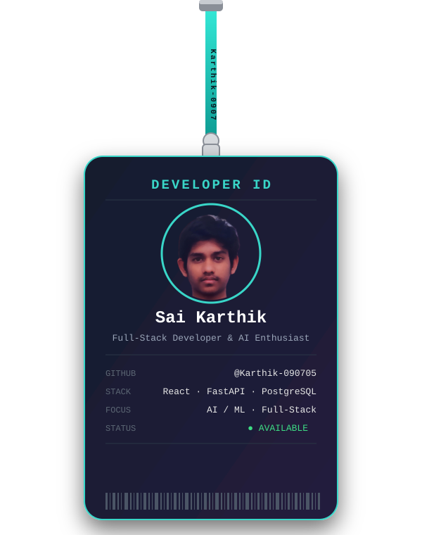

<!--
  ============================================================
  SETUP CHECKLIST (delete this comment block once you're done)
  ============================================================
  1. This file must live in a repo named EXACTLY like your username:
     github.com/YOUR-USERNAME/YOUR-USERNAME  (create it if it doesn't exist,
     check "Add a README file" when creating it).
  2. Find-and-replace "YOUR-USERNAME" everywhere in this file with your
     real GitHub username.
  3. Upload "hero-banner.svg" AND "lanyard-card.svg" (the files next to
     this one) to the ROOT of that same repo. In each of them, replace:
       - "Sai Karthik"                -> your name
       - "Full-Stack Developer..."    -> your title
       - the STACK / FOCUS / tag pills -> your own stack
       - "@YOUR-USERNAME"             -> your real handle
       - the <image href="...">       -> https://github.com/YOUR-USERNAME.png
         (or a direct link to your own photo)
     (No image editor needed — these are plain text files, open them in
     any text/code editor.)
  4. Swap the social links below for your real ones, and remove any
     rows you don't use.
  5. Commit + push. GitHub renders this as your profile page.
-->

  

  

 

## 👋 About Me

I'm a Computer Science student who enjoys turning ideas into working, end-to-end
products — from the database and API layer up to a polished, interactive UI.

- 🔭 Currently building my **Final Year Project** — *AI-Based Epidemic Outbreak
  Prediction Using Satellite Environmental Data*, including a Paederus
  (acid-insect) outbreak-risk case study for West Godavari, Andhra Pradesh.
- 🛠️ Also building a customer-management app for a family business.
- 🌱 Comfortable across the stack with **React, FastAPI, PostgreSQL, and Twilio**.
- ⚡ Motto: *"Code. Build. Repeat."*

 

## 💻 Tech Stack

 

## 🚀 Featured Projects

<table>
  <tr>
    <td width="50%" valign="top">
      <h3>🛰️ AI-Based Epidemic Outbreak Prediction</h3>
      
Final Year Project predicting disease-outbreak risk from satellite
      environmental data, including a Paederus insect-spread case study for
      West Godavari, Andhra Pradesh.

      
    </td>
    <td width="50%" valign="top">
      <h3>🧵 Tailoring Shop Customer App</h3>
      
A customer-management application built for a family tailoring
      business, to track orders and customers in one place.

      
    </td>
  </tr>
</table>

 

### 🐍 Contribution Activity Graph

<picture>
  <source media="(prefers-color-scheme: dark)" srcset="https://raw.githubusercontent.com/karthik-090705/karthik-090705/output/github-contribution-grid-snake-dark.svg?v=1">
  <source media="(prefers-color-scheme: light)" srcset="https://raw.githubusercontent.com/karthik-090705/karthik-090705/output/github-contribution-grid-snake.svg?v=1">
  
</picture>

